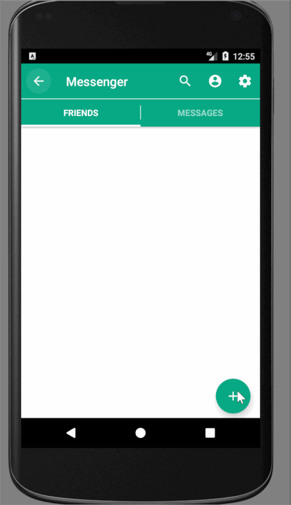

# Messenger
It's a simple P2P-messenger

# View


# Getting Started

If you want help or upgrade our app, you can following the next steps:

```
1. git clone https://central.lugunica.jp/Projects/Android%20Messenger/_git/Messenger   

```
or clone my branch

```
git clone -b rost https://central.lugunica.jp/Projects/Android%20Messenger/_git/Messenger 
```

```
2. Contact me or send a pull request 
```

# Installing app

Search apk file in releases, download and run on your device or use android emulators

# Built With

* [Gradle](https://gradle.org/install/) - Gradel Build Tool v4.1

# Version app

0.39

## Authors
* **Ivankiv Rostyslav** - *Android UI, MVP Architecture, Realm DB*
* **Oleksiy Ratushny** - *Protocol and server communication*
* **Vasiliy Poluch** - *Desing UI/UX*
* **Nadia Bogoslavets** - *Testing*

# Library
* [ButterKnife](http://jakewharton.github.io/butterknife/) - For binding view elements
* [Realm](https://realm.io/docs/java/latest/) - Realm database
* [EventBus](https://github.com/greenrobot/EventBus/) - For different event
* [Stetho](http://facebook.github.io/stetho/) - A debug bridge for Android applications
* [SmartTabLayout](https://github.com/ogaclejapan/SmartTabLayout/) - Tabs
* [ViewPagerTransformers](https://github.com/geftimov/android-viewpager-transformers/) - Add Pager animation
* [CircleImageView](https://github.com/hdodenhof/CircleImageView/) - Circle images
* [SwipeBackLayout](https://github.com/YoKeyword/SwipeBackFragment/) - Swipe back in chat
* [BubbleLayout](https://github.com/MasayukiSuda/BubbleLayout/) - Bubble Layout in account popup window 
* [FloatingActionButton](https://github.com/makovkastar/FloatingActionButton/) - FAB in main screen for adding friends
* [ColorPicker](https://github.com/QuadFlask/colorpicker/) - For picking color from pallet
* [CircleProgress](https://github.com/lzyzsd/CircleProgress/) - For timeout progress

# Leave it here for Software Engineering (2 course)

