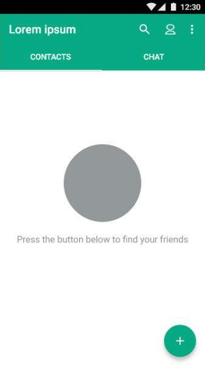
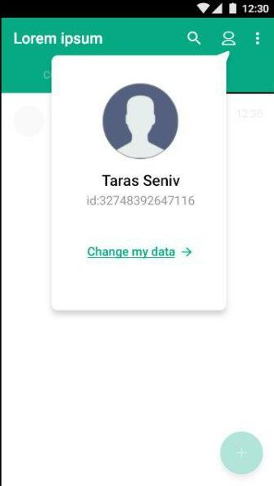
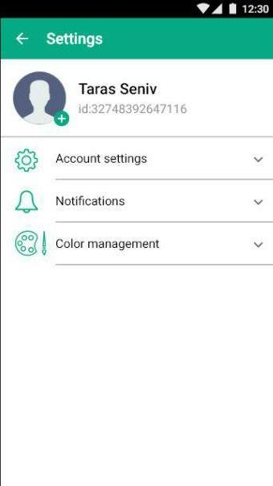
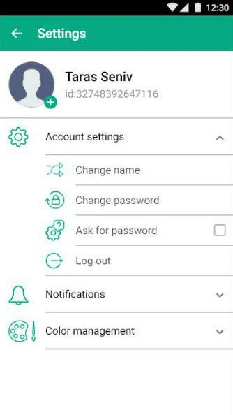

# Messenger
It's a simple P2P-messenger that using wifi broadcast packets for information sending.

## View
<table align="left" width="100%">
  <tbody>
    <tr>
      <td>  </td>
      <td>  </td>
      <td>  </td>
      <td>  </td>
    </tr>
    <tr>
        <td>  </td>
        <td>  </td>
        <td>  </td>
        <td>  </td>
    </tr>
    <tr>
          <td>  </td>
          <td>  </td>
          <td>  </td>
          <td>  </td>
    </tr>
    <tr>
    </tr>
  </tbody>
</table>

# Installing app

Search apk file in releases, download and run on your device or use android emulators

You also can clone this repo and install app using the Android Studio, Intellij Idea or build and then install apk file using a terminal

# Built With

* [Gradle](https://gradle.org/install/) - Gradel Build Tool v4.1

# Version app

0.39

## Authors
* **Ivankiv Rostyslav** - *Android UI, MVP Architecture, Realm DB*
* **Oleksiy Ratushny** - *Protocol and server communication*
* **Vasiliy Poluch** - *Desing UI/UX*
* **Nadia Bogoslavets** - *Testing*

# Libraries
* [ButterKnife](http://jakewharton.github.io/butterknife/) - For binding view elements
* [Realm](https://realm.io/docs/java/latest/) - Realm database
* [EventBus](https://github.com/greenrobot/EventBus/) - For different event handling
* [Stetho](http://facebook.github.io/stetho/) - A debug bridge for Android applications
* [SmartTabLayout](https://github.com/ogaclejapan/SmartTabLayout/) - Tabs
* [ViewPagerTransformers](https://github.com/geftimov/android-viewpager-transformers/) - Add Pager animation
* [CircleImageView](https://github.com/hdodenhof/CircleImageView/) - Circle images
* [SwipeBackLayout](https://github.com/YoKeyword/SwipeBackFragment/) - Swipe back in chat
* [BubbleLayout](https://github.com/MasayukiSuda/BubbleLayout/) - Bubble Layout in account popup window 
* [FloatingActionButton](https://github.com/makovkastar/FloatingActionButton/) - FAB in main screen for adding friends
* [ColorPicker](https://github.com/QuadFlask/colorpicker/) - For picking color from pallet
* [CircleProgress](https://github.com/lzyzsd/CircleProgress/) - For timeout progress

# I just leave it here
