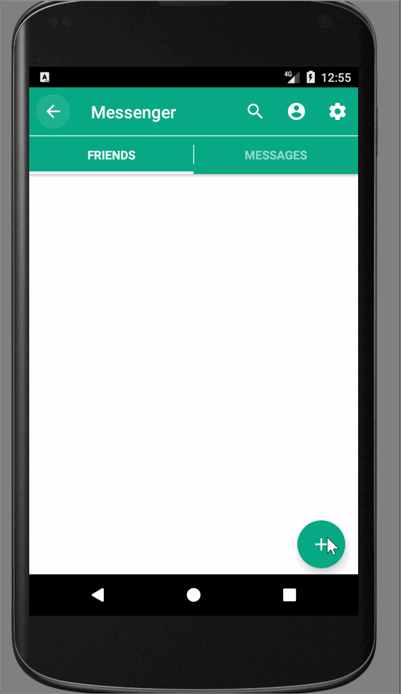

# Messenger
It's a simple P2P-messenger

# View


# Getting Started

If you want help or upgrade our app, you can following the next steps:

```
1. git clone https://github.com/rostIvan/Messenger   

```
or clone my branch

```
git clone -b rost https://github.com/rostIvan/Messenger 
```

```
2. Contact me or send a pull request 
```

# Installing app

Search apk file in releases, download and run on your device or use android emulators

# Built With

* [Gradle](https://gradle.org/install/) - Gradel Build Tool v4.1

# Version app

0.3

## Authors
* **Ivankiv Rostyslav** - *Android UI, MVP Architecture, DB*
* **Oleksiy Ratushny** - *Protocol and server communication*
* **Vasiliy Poluch** - *Desing UI*
* **Nadia Bogoslavets** - *Back end development*

# Library
* [ButterKnife](http://jakewharton.github.io/butterknife/) - For ninding view elements
* [Realm](https://realm.io/docs/java/latest/) - Realm database
* [Stetho](http://facebook.github.io/stetho/) - A debug bridge for Android applications
* [SmartTabLayout](https://github.com/ogaclejapan/SmartTabLayout/) - Tabs
* [ViewPager transformers](https://github.com/geftimov/android-viewpager-transformers/) - Add Pager animation
* [CircleImageView](https://github.com/hdodenhof/CircleImageView/) - Circle images
* [SwipeBackLayout](https://github.com/YoKeyword/SwipeBackFragment/) - Swipe back in chat
# Leave it here for Software Engineering (2 course)

